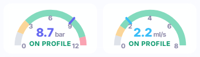
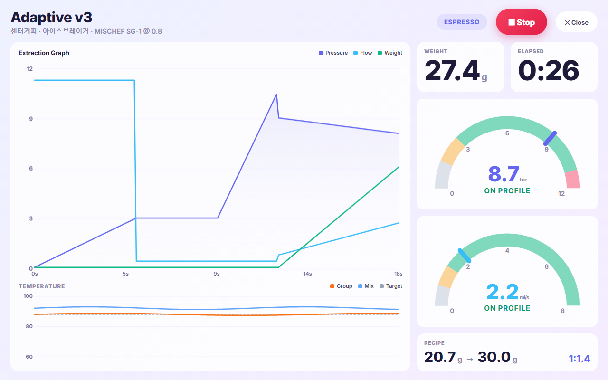
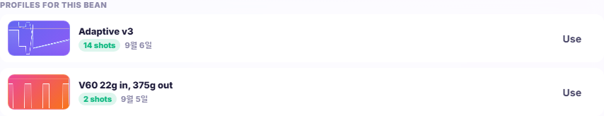
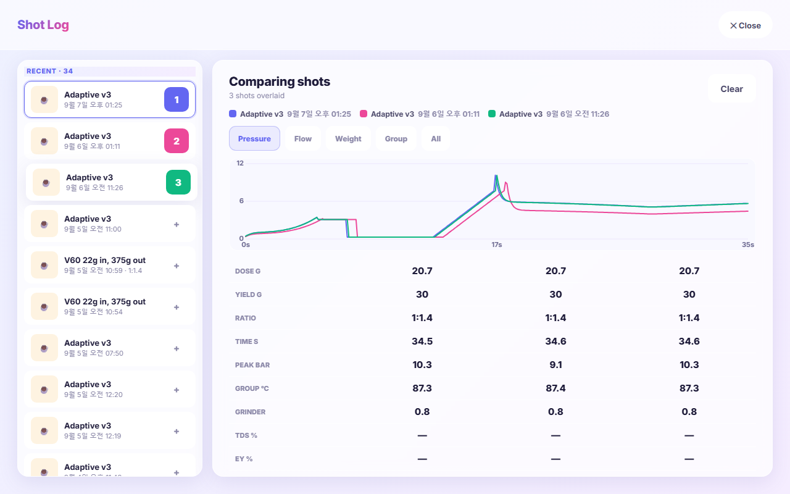
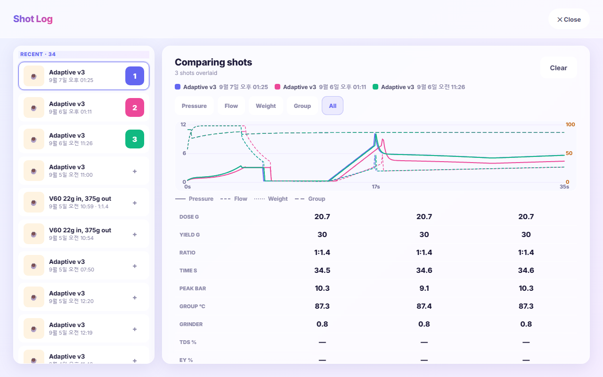
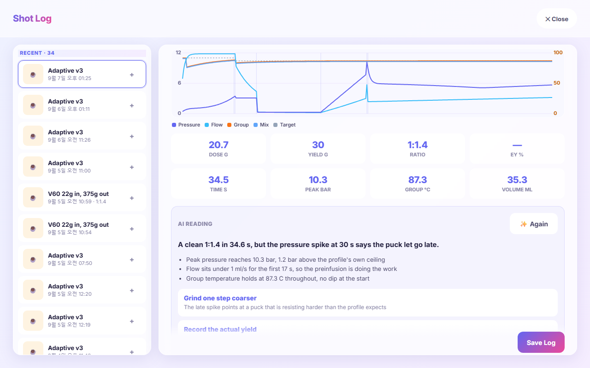

# Liquid Aqua

Decent Espresso 게이트웨이 앱 [Decaid](https://github.com/decentespresso/decaid)를 위한, 밝은 리퀴드 글래스 WebUI 스킨입니다.

**English: [README.md](README.md)**


한 잔을 내리는 데 필요한 것이 한 화면에 다 있습니다. 위쪽에 물탱크와 모든 온도, 가운데에 저울과 레시피가 나란히, 왼쪽을 채우는 추출 그래프, 오른쪽에 프로파일과 원두와 마지막 샷. 스크롤도 없고 메뉴 뒤에 숨는 것도 없습니다.

파일 하나입니다. `index.html` 안에 마크업과 스타일과 자바스크립트가 전부 들어 있고 빌드 단계도 의존성도 없습니다. 게이트웨이의 REST · WebSocket API(포트 `8080`)로 통신합니다.

---

## 목차

- [준비물](#준비물)
- [설치](#설치)
- [메인 화면](#메인-화면)
- [한 잔 내리기](#한-잔-내리기)
- [스팀 · 플러시 · 온수](#스팀--플러시--온수)
- [모니터](#모니터)
- [프로파일](#프로파일)
- [원두와 그라인더](#원두와-그라인더)
- [샷 기록](#샷-기록)
  - [추출 비교](#추출-비교)
  - [AI 추출 분석](#ai-추출-분석)
- [설정](#설정)
- [절전 화면](#절전-화면)
- [데이터가 저장되는 곳](#데이터가-저장되는-곳)
- [문제 해결](#문제-해결)
- [개발](#개발)

---

## 준비물

| | |
|---|---|
| 게이트웨이 | Decaid, WebUI 서버 실행 중 |
| 디스플레이 | 1280×800 기준 설계, 그 외 해상도는 최대 1.6배까지 맞춰 확대 |
| 브라우저 | 최신 브라우저면 됩니다. Chrome, Safari, 안드로이드 WebView에서 검증 |
| 선택 | Google Gemini API 키 — 봉투 사진으로 원두 정보 읽기, 프로파일 추천 |

그 외에는 아무것도 필요 없습니다. 계정도, 클라우드 서비스도, 수집도 없습니다.

## 설치

**앱에서.** Decaid의 스킨 관리자에서 GitHub 릴리즈로 설치하고 `SongPaul/liquid-aqua-skin`을 지정합니다.

**API로.**

```bash
curl -X POST http://<게이트웨이>:8080/api/v1/webui/skins/install/github-release \
     -H 'Content-Type: application/json' \
     -d '{"repo":"SongPaul/liquid-aqua-skin","tag":"v1.2.35"}'
```

`tag`를 빼면 최신 릴리즈가 설치됩니다.

**개발용.** 폴더를 서빙하고 브라우저로 열면 됩니다 — 게이트웨이는 스킨이 알아서 찾습니다.

```bash
python -m http.server 8081
```

---

## 메인 화면

### 헤더

로고, 그리고 머신과 저울에 점 하나씩 — 연결되면 초록, 아니면 회색. 오른쪽은:

| 버튼 | 탭 | 길게 누르기 |
|---|---|---|
| **추출** | 샷을 시작합니다. 진행 중에는 **정지** | — |
| **스팀** / **플러시** / **물** | 해당 동작 실행 | 옵션 열기 |
| **절전** | 머신을 재우고 [절전 화면](#절전-화면) 표시 | — |
| **⚙** | [설정](#설정) | — |

머신에 GHC(물리 버튼 그룹)가 있으면 동작은 머신 버튼이 담당하므로, 스팀·플러시·물은 그냥 탭해도 옵션이 열리고 추출 버튼은 숨겨집니다. 스킨이 감지해서 알아서 바뀝니다.

태블릿 배터리는 게이트웨이가 알려주면 로고 옆에 표시되고, 없으면 브라우저 값으로 대체합니다.

### 물탱크 · 온도 바

탱크가 아래에서 차오르고 느린 파도가 흐릅니다. 색은 **믹스 온도** — 실제로 커피에 닿을 물의 온도입니다.

| | |
|---|---|
| 80 °C 이하 | 파랑 |
| 80 → 95 °C | 1도마다 한 단계씩, 청록 · 초록 · 노랑 · 주황을 거쳐 |
| 95 °C 이상 | 빨강 |

물이 실제로 부족하면 온도와 무관하게 빨간색이 되고 퍼센트 옆에 경고가 뜹니다. 급수 배관을 연결하고 리필 킷을 켠 머신에서는 탱크가 항상 가득 찬 것으로 표시되며 색은 온도를 따릅니다.

### 저울과 레시피

카드 맨 위에 **스팀 · 플러시 · 온수의 현재 설정**이 있습니다. 값이 프리셋과 일치하면 프리셋 이름, 아니면 `직접 설정`. 탭하면 해당 옵션이 열립니다.

아래 왼쪽은 실시간 무게와 **영점** 버튼, 샷 타이머, 그리고 [게이지](#게이지) 둘. 오른쪽은 레시피 스테퍼 넷:

| | |
|---|---|
| **도징 g** | ± 0.1 |
| **추출량 g** | ± 0.5 |
| **비율** | ± 0.1, 도징 기준으로 추출량을 다시 계산 |
| **분쇄도** | 그라인더에 설정한 스텝 단위로 ± 1 |

숫자를 탭하면 키패드로 직접 입력할 수 있습니다. 그라인더 이름은 분쇄도 스테퍼 아래에 있고, 탭하면 그 그라인더 페이지가 열립니다.

### 게이지



압력과 유량은 아크 게이지입니다. 색 구간은 장식이 아니라 **지금 로드된 프로파일**에서 계산됩니다. 같은 바늘 위치라도 프로파일이 다르면 뜻이 다릅니다.

압력 스텝은 자기 압력이 목표이고, 유량 스텝의 리미터는 넘지 말아야 할 압력입니다. 유량은 두 역할이 반대고요. 목표가 거의 0인 스텝(드립·프리필)은 제외합니다. 남은 것이 그 프로파일이 실제로 일하는 범위이고, 게이지는 그 범위를 기준으로 나뉩니다:

| 구간 | | |
|---|---|---|
| 회색 | 크게 미달 | 퍽이 압력을 전혀 못 받는 상태 |
| 주황 | 미달 | 대개 분쇄가 너무 굵을 때 |
| **초록** | **적정** | **프로파일이 요구한 범위** |
| 빨강 | 초과 | 프로파일이 의도한 적 없는 압력 |

수치 아래 라벨이 지금 어느 구간인지 그 구간 색으로 알려줍니다. 눈금은 4분할이라 압력은 0 · 3 · 6 · 9 · 12, 유량은 0 · 2 · 4 · 6 · 8로 표시됩니다.

게이지는 동작에 따라 대상을 바꿉니다. 온수 중에는 왼쪽이 믹스 온도(0–100), 스팀 중에는 오른쪽이 스팀 유량(0–2.5)이 됩니다. 이때는 추출 구간을 표시하지 않습니다 — 프로파일의 압력 범위가 그 값들에 대해 말해주는 게 없기 때문입니다.

프로파일이 없으면 아크 전체가 중립 한 색이 되고 눈금만 남습니다.

### 추출 그래프

압력, 유량, 무게, 그룹·믹스 온도와 목표 온도. 스텝 경계가 표시되고 각 선의 마지막 값에 라벨이 붙습니다. 스팀·플러시·온수가 돌면 그에 맞는 그래프로 바뀝니다.

**그래프를 누르면** [모니터](#모니터)가 열립니다.

---

## 한 잔 내리기

1. 레시피 확인 — 도징, 추출량, 분쇄도.
2. 캐러셀에서 프로파일 확인. **초록 링**이 있는 것이 로드된 프로파일입니다.
3. **추출**. 그래프는 머신이 예열하는 동안이 아니라 실제 추출이 시작될 때부터 그려집니다.
4. 샷이 끝나고, *샷 기록 자동 열기*가 켜져 있으면 테이스팅 폼이 바로 뜹니다.

---

## 스팀 · 플러시 · 온수

레시피 카드의 칩을 탭하거나 헤더 버튼을 길게 누르면 옵션이 열립니다. 각각 이름 붙인 프리셋을 3개까지 저장할 수 있고, **+ 현재 설정 저장**으로 화면의 값을 새 프리셋으로 만듭니다.

**실행 중에는** 레시피 카드가 그 동작이 쓰는 값들의 실시간 컨트롤로 바뀌고, 아래에 동작 이름과 **정지** 버튼이 붙습니다.

| | |
|---|---|
| 스팀 | 온도, 초, 유량 |
| 플러시 | 온도, 초, 유량 |
| 온수 | 온도, 용량, 초, 유량 |

탭하면 바로 반영됩니다. 게이트웨이는 자체 디바운스를 하지 않고 오래 대기한 요청은 버리기 때문에, 스킨이 연속 입력을 모아 마지막 탭 뒤 450 ms에 한 번만 씁니다 — 5번 탭해도 쓰기는 1번입니다.

칩 띠는 실행 중에도 계속 보이고 돌고 있는 것에 테두리가 생기므로, 화면을 떠나지 않고도 나머지 두 설정을 확인할 수 있습니다.

---

## 모니터



하나의 동작을 전체화면으로. 볼 만한 그래프와, 멀리서도 읽히는 숫자만 남깁니다. 추출·스팀·플러시·온수가 시작되면 저절로 열리고(설정의 *전체화면 모니터*로 끌 수 있습니다), 추출 그래프를 누르면 언제든 열립니다.

| | |
|---|---|
| 머리말 | 추출이면 프로파일 이름만, 그 아래 원두·로스터·그라인더·분쇄도. 스팀·플러시·온수는 프로파일로 내리는 것이 아니고 원두와도 무관하므로 **동작 이름이 그 자리를 대신합니다** |
| **추출** | 큰 그래프: 압력, 유량, 무게 |
| **온도** | 그 아래 작은 그래프 — 그룹·믹스·목표, 동작에 따라 스팀 또는 물 온도 |
| 무게 · 경과 | 멀리서 읽을 수 있는 크기 |
| 게이지 둘 | 메인 화면과 같은 구간·눈금, 두 배 크기 |
| 설정 | 추출이면 레시피(도징·추출량·비율). 다른 동작이면 그 동작의 설정: `150° · 50s · 0.8 ml/s` |
| **정지** | 페이지를 벗어나지 않고 실행 중인 동작을 멈춥니다 |

**닫기는 화면만 치울 뿐, 머신을 멈추지 않습니다.** 둘은 별개의 행동이라, 동작이 도는 동안에는 모니터에 **정지** 버튼이 함께 놓입니다. GHC가 달려 있으면 숨겨집니다 — 그때는 그룹헤드가 시작과 정지를 갖고, 같은 이유로 메인 화면도 Start를 숨깁니다.

두 그래프는 폭·여백·샘플 수를 공유하므로, 한쪽의 어느 시점이 다른 쪽의 같은 시점 바로 위아래에 옵니다. 분리한 덕에 추출 그래프가 온도 축과 세로를 나눠 쓰지 않고 압력·유량에 전부 씁니다.

저절로 열린 모니터는 동작이 끝나면 저절로 닫힙니다. 직접 연 것은 닫을 때까지 남습니다.

---

## 프로파일


### 캐러셀

**즐겨찾기**와, 즐겨찾기가 아니더라도 **현재 로드된** 프로파일이 함께 놓입니다. 표시가 둘이고 의미가 다릅니다.

| | |
|---|---|
| **★** 앰버 | 즐겨찾기 |
| **초록 링** | 머신에 현재 로드됨 |

캡션이 둘을 구분해 줍니다. 가운데 카드가 로드된 것이면 `● 현재 로드됨`, 다른 카드로 넘기면 `● 현재: <이름> · 가운데 카드를 눌러 변경`.

- **가운데 카드**나 아래 스트립의 칩을 탭하면 그 프로파일이 로드됩니다.
- **헤더의 ☆** 는 지금 보고 있는 프로파일을 즐겨찾기에 넣거나 뺍니다.
- **편집 ✎** 로 편집기를 엽니다.

### 편집기

왼쪽에 모든 프로파일이 곡선·태그·별과 함께 나열됩니다. 위쪽에는:

- 이름 **검색**.
- **에스프레소 / 브루·티 / 청소·수동 / 전체** 필터와, 숨긴 프로파일을 보는 **숨김**.
- **✨ AI 자동 분류** — 카탈로그 전체를 한 번 읽어 배전도와 형태 태그를 붙입니다.
- **태그 칩**으로 목록을 거릅니다. 태그는 프로파일 자체의 형태(압력제어, 유량제어, 블루밍, 디클라인, 저압, 고온·저온)에서 나오므로 AI 없이도 동작합니다.
- **눈** 아이콘은 삭제하지 않고 선택 목록에서만 숨깁니다. **별**은 즐겨찾기.

오른쪽에서 선택한 프로파일을 편집합니다. 제목, 노트, **카드 색**(프리셋 9개 또는 컬러 피커 — 이 색이 모든 화면의 카드 색이 됩니다), **배전도**, 그리고 스텝을 하나씩, 위쪽 실시간 곡선과 함께.

아래에는 **취소**, **샷에 사용**, **저장**. *샷에 사용*은 화면에 보이는 상태를 그대로 로드하므로 저장하지 않은 수정도 머신에 올라가고, 저장된 프로파일은 **저장** 전까지 그대로입니다.

---

## 원두와 그라인더


원두 카드의 **Edit**, 또는 레시피의 그라인더 이름을 탭하면 열립니다.

### 원두

커피 하나가 원두 하나이고, 같은 커피를 다시 살 때마다 **배치**가 하나씩 생깁니다. 배치는 자기 로스팅 날짜와 배전도를 갖습니다. 변하지 않는 정보 — 로스터, 이름, 원산지, 지역, 생산자, 가공, 품종, 고도, 종, 디카페인 — 는 원두에 붙습니다. 메인 화면의 로스팅 경과일은 지금 쓰는 배치에서 나옵니다.

**샷에 사용**을 누르면 원두가 워크플로우에 들어가서, 이후 모든 샷에 무엇으로 내렸는지가 기록됩니다.

### 봉투 읽기

Gemini 키를 넣어두면 **✨ AI로 라벨 스캔**이 봉투 사진으로 폼을 채웁니다.

- 태블릿에서 **📷 카메라** 또는 **🖼 첨부**.
- **📱 폰 사용**은 QR 코드를 띄웁니다. 폰으로 열어 거기서 봉투를 찍으면 결과가 게이트웨이에 바로 저장됩니다 — 태블릿은 보통 거치돼 있으니 유용합니다.

스캔은 봉투에 적힌 대로, 적힌 언어 그대로 담고, 해당 필드가 없는 정보는 노트에 넣습니다. 이미 있는 커피를 스캔하면 중복 원두 대신 **새 배치**로 추가할지 물어봅니다.

### 세 개의 탭

원두 페이지는 서로 다른 세 가지 일을 하므로 탭이 하나씩 있습니다.

| | |
|---|---|
| **원두 정보** | 스캔 스트립, 모든 필드, 배치 |
| **추출 프로파일** | 이 커피에 어떤 프로파일을 쓸지 |
| **기록** | 실제로 어떻게 내려왔는지 |

열면 **원두 정보**부터 시작합니다. 새 원두에는 아직 기록 탭이 없고, 스캔이 추천을 만들어내면 추출 프로파일 탭에 개수가 붙어서 — 필드를 입력하고 있는 화면에서도 스캔 결과가 눈에 들어옵니다.

### 이 원두의 프로파일



출처가 무엇이든 목록 하나입니다. 각 줄은 프로파일의 곡선과 이름, 그리고 해당하는 배지 — AI가 준 이유와 함께 `추천 1`, 마지막 사용일과 함께 `14회`, 추천이면서 이미 자주 쓰는 프로파일이면 한 줄에 둘 다.

| | |
|---|---|
| **사용** | 머신에 로드 |
| **편집** | 프로파일 편집기로 이동 |
| **기록** | 기록 탭으로 이동해 그 프로파일로 내린 샷만 표시 — 평균도 그 프로파일 기준으로 다시 계산되고, 칩을 누르면 필터가 풀립니다 |

- **이 원두에 맞는 프로파일 추천** 은 *설치된 프로파일 중* 무엇이 맞을지 AI에게 묻고 5개에 순위를 매깁니다. 원두에 저장되므로 다시 열 때는 API를 쓰지 않습니다.
- 횟수는 본인의 샷 기록에서 셉니다 — AI가 필요 없습니다.

### 이 원두 기록


샷 기록이 이 커피에 대해 아는 것 전부. 한 번이라도 내린 적이 있어야 나타납니다.

| | |
|---|---|
| **평균 도징 / 추출량 / 비율 / 분쇄도** | 기록된 모든 샷의 평균. 샷에 남긴 실측값이 레시피 값보다 우선합니다 — 저울에 실제로 올라간 값이니까요. 비율은 두 평균을 나눈 게 아니라 샷마다 계산해서 평균 낸 값입니다. 분쇄도는 숫자 다이얼이면 평균을, 이름 붙인 포지션이면 가장 많이 쓴 값을 씁니다 |
| **평균 평점** | 평점을 매긴 샷이 있을 때만 |
| **샷 횟수와 기간** | 제목 옆에 |
| **추출 기록** | 최근 20건, 각각 프로파일 곡선과 내린 시각, 도징 → 추출량과 비율, 거쳐 간 그라인더와 분쇄도, 평점. **누르면** 샷 기록에서 열립니다 — 거기 그래프는 프로파일 모양이 아니라 실제 기록이고, 모든 수치와 테이스팅 로그가 함께 나옵니다 |

### 그라인더

모델, 버, 버 타입과 크기, 그리고 분쇄 설정 — 본인의 미세·거친 스텝을 가진 **숫자 다이얼**이거나 **이름 붙인 프리셋** 목록. 나머지는 노트에.

---

## 샷 기록


기록된 모든 샷이 최신순으로, 평점과 함께. 하나를 고르면 실제로 기록된 곡선(압력·유량·무게·온도), 핵심 수치, 그리고 테이스팅 로그가 나옵니다.

| | |
|---|---|
| 실제 도징 / 추출량 | 저울에 실제로 올라간 값 |
| TDS % / 추출 수율 % | 측정한다면 |
| 만족도 | 별 다섯 |
| 노트 | 자유 입력 |

**저장**하면 게이트웨이에 기록됩니다. 설정에서 *샷 기록 자동 열기*를 켜면 샷이 끝날 때 이 폼이 저절로 열립니다.

### 추출 비교



샷 하나는 무슨 일이 있었는지 알려주고, 두 개는 무엇이 달라졌는지 알려줍니다.

목록의 모든 줄 오른쪽에 **+** 가 있습니다. 누르면 그 샷이 비교에 들어가면서 색과 번호를 갖고, 다시 누르면 빠집니다. 최대 네 개까지.

두 개 이상 고르면 상세 화면이 겹쳐보기로 바뀝니다. 한 가지 측정값을 모든 샷에 걸쳐, 같은 축 위에 그립니다. 두 추출의 차이가 두 선 사이의 거리로 보입니다.

| | |
|---|---|
| **압력 / 유량 / 무게 / 그룹** | 무엇을 겹쳐볼지 고릅니다. 축은 보고 있는 값에 맞춰 다시 잡힙니다 |
| **전체** | 네 가지를 한 번에. 색은 그대로 어느 샷인지, 선 모양이 어느 값인지 알려줍니다 |
| 색 범례 | 어느 선이 어느 샷인지, 내린 시각과 함께 |
| 아래 표 | 도징, 추출량, 비율, 시간, 최고 압력, 그룹 온도, 분쇄도, TDS, EY, 평점을 샷마다 한 열씩 |

시간 축은 보고 있는 값이 아니라 기록 자체에서 나옵니다. 탭을 바꿔도 샷이 가로로 움직이지 않습니다.



**전체**는 단일 샷 그래프와 같은 두 축을 씁니다. 왼쪽은 압력, 오른쪽은 온도, 유량과 무게는 그 사이에. 선 모양 범례가 그래프 아래에 붙습니다.

**해제**를 누르면 열어두었던 단일 샷으로 돌아옵니다. 샷을 하나 선택하는 것과 비교에 담는 것은 서로 간섭하지 않습니다.

### AI 추출 분석



수치 아래 **분석**을 누르면 이 샷을 Gemini에 보내 곡선이 무엇을 했는지 묻습니다. 사용한 프로파일, 원두와 분쇄도, 측정된 값들, 적어둔 테이스팅 노트, 그리고 곡선 자체를 스물네 점 남짓으로 줄여서 함께 보냅니다. 요약이 아니라 지금 보고 있는 그 기록입니다.

결과는 한 줄 판단, 관찰 몇 가지, 그리고 다음에 바꿔볼 것 세 가지까지 — 각각 이유와 함께 돌아옵니다.

비교 중에도 동작하고, 그때는 질문이 달라집니다. 이 샷들 사이에서 실제로 무엇이 다른지, 어느 쪽을 따라가야 하는지. 프롬프트에는 주어진 수치에만 근거하고 데이터로 판단할 수 없는 것은 그렇다고 말하도록 적혀 있습니다.

분석 결과는 대상 샷을 기준으로 브라우저에 저장되므로, 샷을 다시 열면 호출 없이 그대로 나옵니다. 설정에 Gemini API 키가 있어야 하고, 없으면 **분석**이 설정 화면으로 데려갑니다.

---

## 설정


### 일반

| | |
|---|---|
| 언어 | 자동, English, 한국어 |
| 온도 | °C / °F |
| 무게 | g / oz |
| 나이트 모드 | 다크 테마 |
| 자동 나이트 모드 | 시간대에 따라 전환 |
| 샷 기록 자동 열기 | 샷이 끝나면 테이스팅 폼을 바로 표시 |

### 화면

| | |
|---|---|
| 밝기 | 패널 밝기, 100 = 자동 |
| 전체화면 모니터 | 동작이 시작되면 [모니터](#모니터)를 자동으로 엽니다 |
| 화면 항상 켜기 | 머신이 깨어 있는 동안 화면을 켜둡니다. 머신이 잠들면 즉시 해제되어 태블릿 자체 타임아웃이 동작합니다 |
| 저전력 밝기 제한 | 배터리가 적을 때 밝기 상한 |
| 절전 시 어둡게 | 절전 화면이 떠 있는 동안 밝기를 낮춤 |
| 절전 밝기 | 얼마나 낮출지 |

### 머신

리필 경고 수위, 물 보정(2점 방식 또는 정해진 양을 부어 재는 방식), 리필 킷과 오버라이드, 유량 보정 계수.

### 펌웨어 · AI · 플러그인

펌웨어 버전과 업데이트. **Gemini API 키** — 해당 기기에만 저장되며 라벨 스캔·프로파일 추천·분류에 쓰입니다. 설치된 플러그인과 설정.

---

## 절전 화면


헤더 버튼으로 재우거나, 머신이 스스로 잠들어도 스킨이 따라갑니다. 시계와 날짜, 배터리, 그리고 탭하라는 안내.

화면이 쓸 수 있는 전력을 거의 0에 가깝게 맞춰 만들었습니다.

- wake-lock 오버라이드를 **해제**해서 태블릿 자체 화면 타임아웃이 동작하게 합니다
- 잠금 화면 뒤의 UI는 그리기를 멈추고 그래프도 다시 그리지 않습니다
- 탱크 파도 애니메이션을 숨기는 게 아니라 **정지**시킵니다

전체화면 페이지(원두, 프로파일 편집, 샷 기록, 설정)도 열려 있는 동안 같은 일을 합니다 — 뒤에 있는 인터페이스가 그리기를 멈추고 파도도 멈춰서, 페이지 하나가 초당 CPU 38 ms에서 5 ms가 됩니다.
- 밝기를 설정한 절전 밝기로 낮췄다가 깨어날 때 되돌립니다

머신을 실제로 idle ↔ sleeping으로 구동하며 측정한 값: 절전 중 **초당 CPU 2 ms**, 깨어 있을 때 26 ms.

---

## 데이터가 저장되는 곳

**게이트웨이** — 모든 기기가 같은 것을 보도록: 워크플로우(프로파일, 도징, 추출량, 그라인더, 커피), 스팀·플러시·온수 설정, 원두와 배치, 그라인더, 샷과 테이스팅 노트. 프로파일의 색·태그·배전도는 그 프로파일의 `metadata`에, 원두의 저장된 추천은 `extras`에 함께 실립니다.

**기기 로컬** — `localStorage`:

| 키 | |
|---|---|
| `aurora_prefs` | 언어, 단위, 나이트 모드, 절전 옵션, 물 보정 |
| `aurora_favs` | 즐겨찾기 프로파일 |
| `aurora_presets` | 스팀·플러시·온수 프리셋 |
| `aurora_shotai` | AI 추출 분석 결과, 대상 샷 기준 |
| `aurora_gemini` | 봉투를 스캔한 폰에 저장되는 API 키 |

---

## 문제 해결

**물이 뜨겁지 않은데 탱크가 빨간색입니다.** 탱크 수위가 리필 기준 이하로 읽히고 있습니다. 배관을 연결한 머신이라면 설정 › 머신에서 *리필 킷*을 켜세요 — 게이지가 가득 찬 것으로 표시되고 색이 온도를 따릅니다.

**AI 버튼을 눌러도 아무 일이 없습니다.** Gemini 키가 없습니다. 설정 › AI.

**폰 QR로 연 페이지가 게이트웨이에 닿지 못합니다.** 게이트웨이가 폰에서 보이지 않는 주소를 알려주고 있습니다. 폰에서 게이트웨이의 LAN 주소로 스킨을 한 번 열어주면, 그 주소를 기억해 QR에 씁니다.

**화면이 안 꺼집니다.** *화면 항상 켜기*가 켜져 있고 머신이 깨어 있습니다. 머신이 잠들면 자동으로 해제됩니다.

**글자가 너무 작거나 잘립니다.** 1280×800으로 배치한 뒤 화면에 맞춰 확대합니다. 아주 좁은 창에서는 리플로우 대신 레터박스가 됩니다.

---

## 개발

```
index.html          스킨 전체
skin-manifest.json  id, 이름, 설명, 버전
docs/               이 문서의 스크린샷
```

빌드도 패키지 매니저도 없습니다. `index.html`을 고치고 새로고침하면 됩니다.

일관성을 유지하는 규칙:

- 모든 컨트롤은 짧은 변이 최소 40 px, 어떤 글자도 11 px 아래로 렌더링되지 않습니다.
- 한 화면에 그라디언트로 채운 컨트롤은 하나 — 주 동작. 액센트 색을 쓰는 나머지는 채우지 않고 틴트만 합니다.
- 값이 내용이고 버튼은 배경입니다. 숫자가 양옆 버튼보다 큽니다.
- 레이아웃은 고정 1280×800 무대입니다. 새로 넣을 것이 안 들어가면, 어딘가가 의도적으로 높이를 양보합니다.

## 라이선스

MIT
