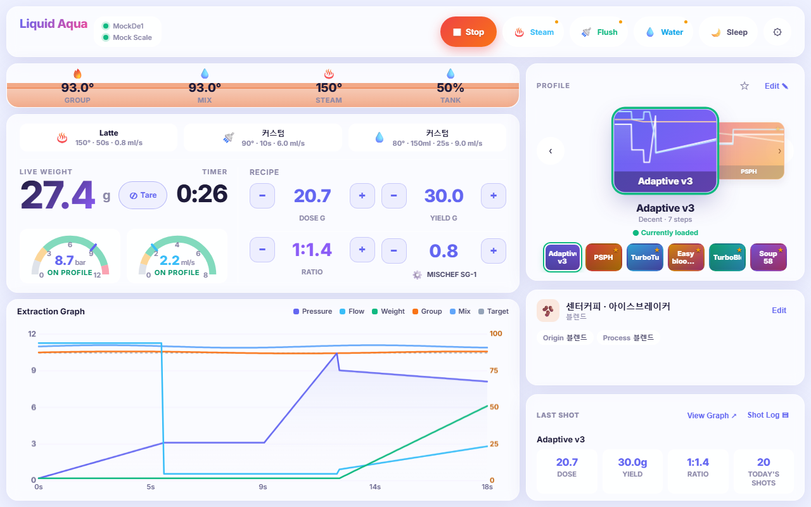
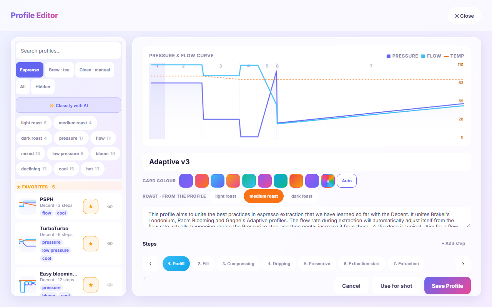
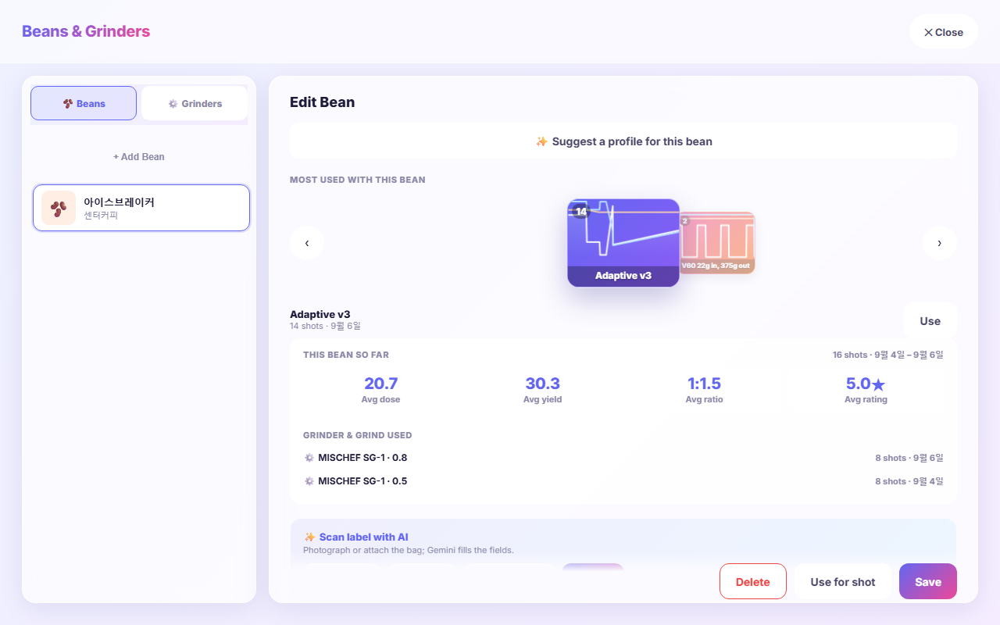
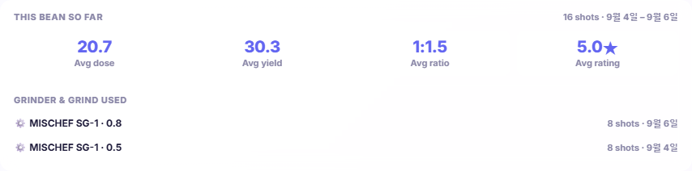
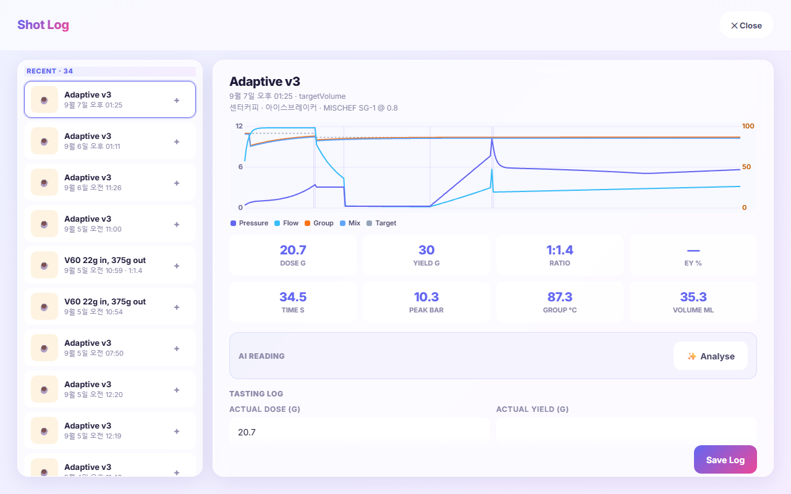
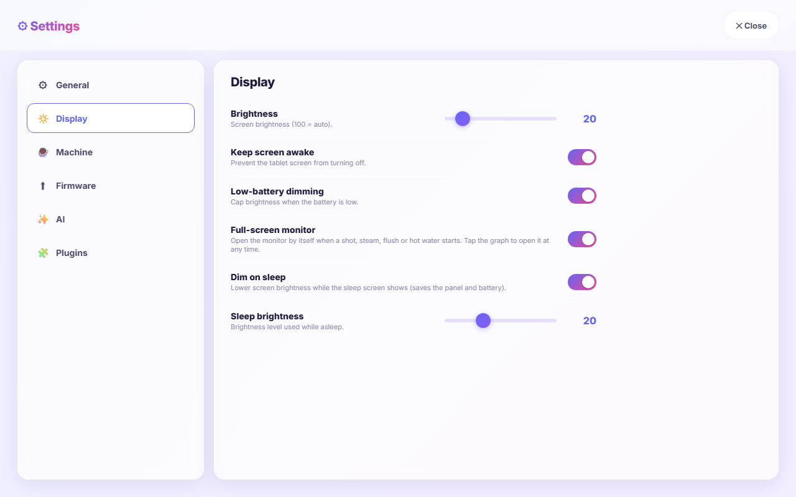
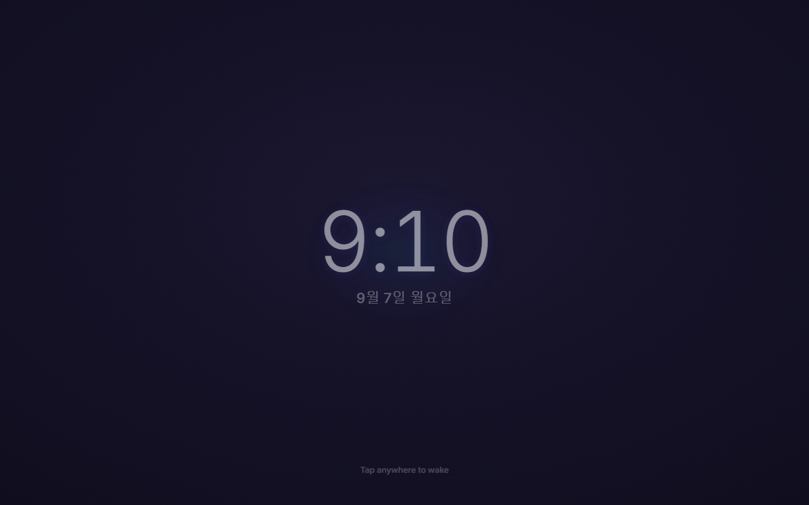

# Liquid Aqua

A bright, liquid-glass WebUI skin for [Decaid](https://github.com/decentespresso/decaid), the Decent Espresso gateway app.

**한국어 설명서: [README.ko.md](README.ko.md)**



Everything you need for a shot is on one screen: the water tank and every temperature across the top, the scale and the recipe side by side, the extraction graph filling the left, and your profiles, your coffee and your last shot down the right. Nothing scrolls, nothing hides behind a menu.

It is a single file. `index.html` holds the markup, the styles and the JavaScript — no build step, no dependencies. It talks to the Decaid gateway over its REST and WebSocket APIs on port `8080`.

---

## Contents

- [Requirements](#requirements)
- [Install](#install)
- [The main screen](#the-main-screen)
- [Pulling a shot](#pulling-a-shot)
- [Steam, flush and hot water](#steam-flush-and-hot-water)
- [Profiles](#profiles)
- [Beans and grinders](#beans-and-grinders)
- [Shot log](#shot-log)
- [Settings](#settings)
- [Sleep screen](#sleep-screen)
- [Where things are stored](#where-things-are-stored)
- [Troubleshooting](#troubleshooting)
- [Development](#development)

---

## Requirements

| | |
|---|---|
| Gateway | Decaid, with the WebUI server running |
| Display | Designed for 1280×800; scales to fit anything else, up to 1.6× |
| Browser | Any current browser. Chrome, Safari and the Android WebView are what it is tested against |
| Optional | A Google Gemini API key, for reading a coffee bag from a photo and for profile suggestions |

The skin needs nothing else. No account, no cloud service, no telemetry.

## Install

**From the app.** Open Decaid's skin manager and install from a GitHub release, pointing at `SongPaul/liquid-aqua-skin`.

**From the API.**

```bash
curl -X POST http://<gateway>:8080/api/v1/webui/skins/install/github-release \
     -H 'Content-Type: application/json' \
     -d '{"repo":"SongPaul/liquid-aqua-skin","tag":"v1.2.35"}'
```

Omit `tag` to take the latest release.

**For development.** Serve the folder and point a browser at it — the skin finds the gateway on its own:

```bash
python -m http.server 8081
```

---

## The main screen

### Header

The brand, then the machine and the scale with a dot each — green when connected, grey when not. On the right:

| Button | Tap | Hold |
|---|---|---|
| **Start** | Begins the shot; becomes **Stop** while one runs | — |
| **Steam** / **Flush** / **Water** | Runs that action | Opens its options |
| **Sleep** | Puts the machine to sleep and shows the [sleep screen](#sleep-screen) | — |
| **⚙** | Opens [Settings](#settings) | — |

If the machine has a GHC (the physical button group), the machine's own buttons run the actions, so Steam, Flush and Water open their options on a plain tap instead, and Start is hidden. The skin detects this and relabels itself.

The tablet battery appears next to the brand when the gateway reports it, or from the browser as a fallback.

### Water and temperature bar

The tank fills from the bottom and carries a slow wave. Its colour is the **mix temperature**, which is the water that will actually hit the coffee:

| | |
|---|---|
| up to 80 °C | blue |
| 80 → 95 °C | one shade per degree, through teal, green, yellow and orange |
| 95 °C and above | red |

If the tank is genuinely low it turns red regardless, and a warning appears next to the percentage. On a plumbed machine with the refill kit enabled the tank always reads full and the colour stays with the temperature.

### Scale and recipe

Across the top of this card sit the current **steam, flush and water settings** — the preset name if the numbers match one, otherwise `Custom`. Tap any of them to open its options.

Below on the left: live weight with a **Tare** button, the shot timer, and pressure and flow. On the right, the recipe as four steppers:

| | |
|---|---|
| **Dose g** | ± 0.1 |
| **Yield g** | ± 0.5 |
| **Ratio** | ± 0.1, recalculating the yield from the dose |
| **Grind** | ± one step of your grinder's own step size |

Tap any number to type it on a keypad instead. The grinder's name sits under its stepper — tap it to open that grinder's page.

### Extraction graph

Pressure, flow, weight, group and mix temperature and the target, with step boundaries marked and the final value labelled on each line. It switches to a steam or hot-water graph while those run. **Shot Log** at the top opens the [history](#shot-log).

---

## Pulling a shot

1. Check the recipe — dose, yield, grind.
2. Check the profile in the carousel. The one with the **green ring** is loaded.
3. **Start**. The graph begins when real extraction does, not while the machine is heating.
4. The shot ends, and if *Auto-open shot log* is on, the tasting form opens straight away.

---

## Steam, flush and hot water

Tap the chip in the recipe card, or hold the header button, to open the options for that action. Each has up to three named presets, and **+ Save current** stores what is on screen as a new one.

**While the action runs**, the recipe card turns into live controls for exactly the numbers that action uses, with the action and a **Stop** button underneath:

| | |
|---|---|
| Steam | temperature, seconds, flow |
| Flush | temperature, seconds, flow |
| Hot water | temperature, volume, seconds, flow |

Changes take effect as you tap. The gateway does no debouncing of its own and drops requests that queue too long, so the skin batches your taps and writes once, 450 ms after you stop — five taps produce one write.

The chip band stays visible the whole time, with the running one outlined, so you can see the other two settings without leaving.

---

## Profiles



### The carousel

Your **favourites**, plus whatever is **loaded** even if it is not a favourite. Two markers, two meanings:

| | |
|---|---|
| **★** amber | a favourite |
| **green ring** | currently loaded on the machine |

The caption says which is which. When the centred card *is* the loaded one it reads `● Currently loaded`; when you scroll past it, `● Loaded: <name> · tap center to change`.

- **Tap the centred card**, or a chip in the strip below, to load that profile.
- **☆ in the header** adds the profile you are looking at to your favourites, or removes it.
- **Edit ✎** opens the editor.

### The editor

The left column lists every profile with its curve, its tags and a star. Above it:

- **Search** by name.
- **Espresso / Brew · tea / Clean · manual / All** filters, and **Hidden** for profiles you have hidden.
- **✨ Classify with AI** reads your whole catalogue once and tags each profile — roast level and shape.
- **Tag chips** filter the list, with a count each. Tags come from the profile's own shape (pressure, flow, blooming, decline, low pressure, high or low temperature) so they work with no AI at all.
- The **eye** hides a profile from the pickers without deleting it. The **star** favourites it.

The right column edits the selected profile: title, notes, **card colour** (nine presets or a colour picker — this is the colour its card shows everywhere), **roast level**, and the steps, one at a time, with a live curve above.

At the bottom: **Cancel**, **Use for shot** and **Save Profile**. *Use for shot* loads what is on screen, so unsaved edits are what the machine gets; the stored profile is untouched until you save.

---

## Beans and grinders



Reachable from **Edit** on the bean card, or by tapping the grinder name in the recipe.

### Beans

A coffee is one bean; each time you buy it again is a **batch** with its own roast date and roast level. The bean carries what does not change — roaster, name, origin, region, producer, processing, variety, altitude, species, decaf. Days off roast on the main screen come from the batch you are using.

**Use for shot** puts the bean in the workflow so every shot records what it was pulled with.

### Reading the bag

With a Gemini key set, **✨ Scan label with AI** fills the form from a photo of the bag.

- **📷 Camera** or **🖼 Attach** on the tablet.
- **📱 Use phone** shows a QR code. Open it on a phone, photograph the bag there, and the result saves straight to the gateway — useful because the tablet is usually mounted.

The scan keeps what the bag says, in the language the bag says it, and puts anything that has no field of its own into the notes. Scanning a coffee you already have offers to add it as a **new batch** rather than a duplicate bean.

### Suggestions and history

Two carousels at the top of the bean, side by side:

- **Suggested profiles** — ask AI which of *your installed* profiles suits this coffee. Five ranked cards, each with its curve and a one-line reason. Saved with the bean, so reopening it costs no API call.
- **Most used with this bean** — counted from your own shot history, with how many shots and when the last one was.

**Use** on either loads that profile.

### This bean so far



Everything the shot history knows about this coffee, in one panel — it appears once the bean has been pulled at least once and stays hidden until then.

| | |
|---|---|
| **Avg dose / yield / ratio** | Averaged over every recorded shot. A shot's own annotation wins over the recipe it was pulled with, because that is what really landed on the scale. The ratio is averaged per shot, not derived from the two averages |
| **Avg rating** | Shown only if you have rated any of them |
| **Shot count and date range** | Beside the heading |
| **Grinder & grind used** | Every grinder-and-setting pair this coffee has gone through, most used first, with a count and when it was last used |

### Grinders

Model, burrs, burr type and size, and a grind setting that is either a **numeric dial** with your own fine and coarse step, or a list of **named presets**. Notes for anything else.

---

## Shot log



Every recorded shot, newest first, with its rating. Pick one to see the recorded curve — pressure, flow, weight and the temperatures as they actually happened — the headline numbers, and the tasting log:

| | |
|---|---|
| Actual dose / yield | what really landed on the scale |
| TDS % / Extraction yield % | if you measure it |
| Enjoyment | five stars |
| Notes | free text |

**Save Log** writes it back to the gateway. Turn on *Auto-open shot log* in Settings to have this open by itself when a shot ends.

---

## Settings



### General

| | |
|---|---|
| Language | Auto, English, 한국어 |
| Temperature | °C / °F |
| Weight | g / oz |
| Night mode | Dark theme |
| Auto night mode | Switches by time of day |
| Auto-open shot log | Shows the tasting form as soon as a shot ends |

### Display

| | |
|---|---|
| Brightness | Panel brightness; 100 = auto |
| Keep screen awake | Holds the screen on while the machine is awake. Released the moment it sleeps, so the tablet's own timeout can take over |
| Low-battery dimming | Caps brightness when the battery is low |
| Dim on sleep | Lowers brightness while the sleep screen shows |
| Sleep brightness | How far it dims |

### Machine

Refill warning level, water calibration (two-point or by pouring a measured amount), refill kit and its override, and flow calibration multipliers.

### Firmware · AI · Plugins

Firmware version and update. The **Gemini API key**, stored on that device only and used for label scanning, profile suggestions and classification. Installed plugins and their configuration.

---

## Sleep screen



Sleep from the header button, or let the machine sleep on its own — the skin follows either way. A clock, the date, the battery, and a hint to tap.

It is built to cost as close to nothing as a screen can:

- the wake-lock override is **released**, so the tablet's own display timeout applies
- the interface behind the lock stops painting, and the graph stops redrawing
- the tank's wave animation is paused, not merely hidden
- brightness drops to your sleep level and is restored on wake

Measured with the machine driven through idle and sleeping: **2 ms of CPU per second of wall clock** while asleep, against 26 ms awake.

---

## Where things are stored

**On the gateway**, so every device sees the same thing: the workflow (profile, dose, yield, grinder, coffee), steam, flush and hot-water settings, beans and batches, grinders, shots and their tasting notes. A profile's colour, tags and roast level ride along in its `metadata`; a bean's saved suggestions in its `extras`.

**On the device**, in `localStorage`:

| Key | |
|---|---|
| `aurora_prefs` | language, units, night mode, sleep options, water calibration |
| `aurora_favs` | favourite profiles |
| `aurora_presets` | steam, flush and water presets |
| `aurora_gemini` | the API key on a phone that scanned a bag |

---

## Troubleshooting

**The tank is red and the water is not hot.** The tank is reading at or below the refill level. On a plumbed machine, turn *Refill kit* on in Settings › Machine — the gauge then reads full and the colour follows the temperature.

**AI buttons do nothing.** No Gemini key. Settings › AI.

**The phone QR opens a page that cannot reach the gateway.** The gateway is reporting an address the phone cannot see. Open the skin once on the phone using the gateway's LAN address; it remembers it for the QR.

**The screen never turns off.** *Keep screen awake* is on and the machine is awake. It is released automatically once the machine sleeps.

**Everything is tiny or clipped.** The skin lays out at 1280×800 and scales to fit. Very narrow windows will letterbox rather than reflow.

---

## Development

```
index.html          the entire skin
skin-manifest.json  id, name, description, version
docs/               screenshots for this README
```

No build, no package manager. Edit `index.html`, reload.

Conventions that keep it coherent:

- Every control is at least 40 px on its shortest side, and nothing renders below 11 px.
- One gradient-filled control per view — the primary action. Everything else that carries the accent colour is tinted, not filled.
- Values are the content and buttons are chrome: the number is larger than the buttons around it.
- Layout is a fixed 1280×800 stage. If something new does not fit, something else gives up height on purpose.

## License

MIT
